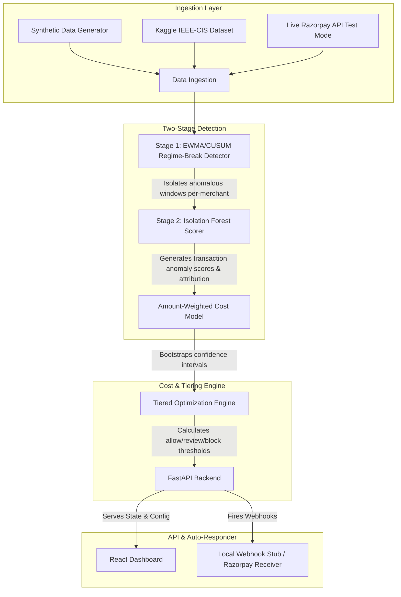

# Architecture

### Ingestion Layer
**What it does:** Aggregates transaction data from three distinct sources: a rigorous synthetic data generator that simulates 30 days of volume, real-world anonymized fraud data from the Kaggle IEEE-CIS dataset, and live test-mode Razorpay checkout events via the SDK.
**Design reasoning:** We built our own synthetic generator to rigorously test cold-start problems and specific anomaly types (volume spikes, geo-shifts, card testing). We back this up with Kaggle data for real-world validation, and live Razorpay transactions for demo interactivity and end-to-end webhook verification.
**Known limitations:** The live Razorpay integration relies on manual `[FIRE_LIVE_TXN]` triggers from the UI; it does not automatically ingest real merchant production streams.

### Two-Stage Detection
**What it does:** First, a per-merchant EWMA (Exponentially Weighted Moving Average) and CUSUM (Cumulative Sum) pipeline detects macro-level regime breaks in volume and ticket size. Second, an Isolation Forest model analyzes the flagged windows to score individual transactions and attribute reasons (e.g., `amount (+2.1σ)`).
**Design reasoning:** Why regime breaks over a flat classifier? Because fraud isn't a static profile—it's a sudden deviation from *that specific merchant's* baseline. The two-stage approach filters out 90% of the noise at the macro level, ensuring the heavier Isolation Forest model only evaluates high-risk temporal windows.
**Known limitations:** The cold-start blending logic is rudimentary (simple linear blending from a global tier average to the merchant's specific average over 72 hours). A production system would need a robust embedding-based merchant similarity model to handle cold starts accurately.

### Cost & Tiering Engine
**What it does:** Translates arbitrary anomaly scores into real-world business value. It minimizes the sum of false negatives (chargeback costs) and false positives (churned good revenue) by calculating optimal `allow`, `review`, and `block` thresholds. It calculates this dynamically per volume-segment and computes bootstrapped confidence intervals.
**Design reasoning:** All fraud is not created equal. Missing a ₹1,000 fraud costs less than missing a ₹1,000,000 fraud. We use an *amount-weighted* cost model. We calculate tiered thresholds because adding a "review" tier (which introduces operational cost but saves good transactions) drastically outperforms a simple binary block/allow naive threshold.
**Known limitations:** The `review_cost` and `FP/FN` multipliers are currently static inputs (configurable via UI sliders). In reality, false positive churn costs vary wildly by merchant and customer LTV (Life-Time Value), and would require integration with a CRM or analytics engine.

### API Layer & Console
**What it does:** A FastAPI backend stores the state in memory, serves the cost curves, timeline aggregations, and webhook logs, and communicates with a Vite + React SPA front-end. The frontend features a merchant overview, detailed temporal timelines, and an interactive cost ablation dashboard.
**Design reasoning:** We separated the backend and frontend to simulate a true distributed architecture. We implemented the Replay Mode entirely in the React frontend to visually demonstrate the passage of time and asynchronous webhook firing without requiring a complex streaming backend infrastructure for the demo.
**Known limitations:** The backend state is entirely in-memory using Pandas DataFrames. It is reset on every container deployment.

---

### What stands between this and production?
*   **Persistent Storage & Streaming Engine:** The entire system currently runs batch processing on in-memory Pandas dataframes. A production system requires Kafka/Kinesis for streaming ingestion, and a time-series database (like ClickHouse or TimescaleDB) or feature store for stateful aggregation.
*   **Cold Start at Scale:** The current tier-prior fallback is basic. Scaling requires clustering thousands of merchants to find "lookalike" baseline behaviors during the critical first 72 hours.
*   **Delayed Label Handling:** The Kaggle validation set has perfect, instant ground truth. Real-world chargebacks arrive 30-90 days late. We stubbed a Razorpay dispute webhook receiver to simulate closing this loop, but a production model needs continuous online recalibration using techniques like PU (Positive-Unlabeled) learning.
*   **RBI Compliance:** Data localization, PII masking, and strict audit logs on who viewed/altered the review queue are required for Indian payment aggregators.
